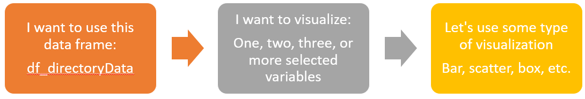
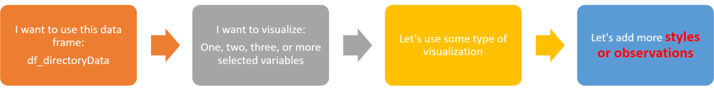

```{r setup, include=FALSE}
knitr::opts_chunk$set(echo = TRUE)
```

# Review and Quick Preparation

## Loading libraries (or packages) 

The package `tidyverse` contains all packages that we will use today except `readr`.

```{r, library, echo = TRUE, warning = FALSE, message=FALSE}

library(tidyverse)
library(readr)

```
<br>

## Data Prep

### Working Directory Setup

`getwd()` function will let you know which working directory R is using now. `setwd()` will change your working directory.

For the rest of this training, **you must set your working directory** like 

  /home/*type_your_account*/Documents/RTraining_06132018/
  
by using **`setwd("/home/*type_your_account*/Documents/RTraining_06132018/")`**


```{r}
# what is my user info?
print("What is my user Info?")
Sys.getenv('USER')

filePath <- paste0("/home/", Sys.getenv('USER'),"/Documents/RTraining_06132018/")

# set a working directory
setwd(filePath)

# what is my current working directory?
print("What is my current working directory?")
getwd()
```


**Make sure** that 
 1. Everything is *case-sensitive*,
 2. You provide your accurate account name to AHRI R-Server (for example, *ahritrain8*), and
 3. You use forwarded slash ('/') instead of backslash ('\').

> Note: **Documents** begins with large 'D' and ends with small 's'.


### Loading a file
We will load a ACS ULE file that have used for the past training. Note: the ULE ACS data is saved at the subfolder *inputFiles*.

```{r, ACSread, warning = FALSE, message=FALSE}
ACS_ULE_20132017 <- read_csv(paste0(filePath,"inputFiles/ACS_ULE_20132017.csv"))
```
<br>

Then, make a copy of the original ULE ACS data frame by using `ACS_ULE <- ACS_ULE_20132017`.   

```{r, copyACS, warning = FALSE, message=FALSE} 
ACS_ULE <- ACS_ULE_20132017
```
<br>

### Making names *syntactically* correct and dropping missing records

Do you remember we used to `make.names()` and `drop_na()` in order to make column names tidy and remove useless data. The file has gone through this tedious part of `make.names()` and `drop_na()`.

Just to remind what we did:

`names(ACS_ULE) <- names(ACS_ULE) %>% make.names(unique = TRUE)`
`ACS_ULE <- drop_na(TestResult)`

### Taking a quick summary look on the data frame

I hope you still remember `str()`, `glimpse()`,  `summary()`, `table()`.

```{r, subset1, warning = FALSE, message=FALSE}
ACS_ULE[ ,c(1:10)] %>% glimpse()
ACS_ULE[ ,c(1:10)] %>% summary()
```
<br>  

### Accessing individual columns

`data_frame$varName` will access individuals column in the data frame. Note that this will eventually return vector, not data frame.

You may also assign a new column: `data_frame$newVar <- ... some operation ...` Here, let's calcualte a power consumption by using EER and cooling capacity.

```{r, subset2, warning = FALSE, message=FALSE}
ACS_ULE$power95F <- ACS_ULE$Capacity95FHigh / ACS_ULE$EER95F
ACS_ULE %>% select(Dir.ReferenceNumber, power95F) %>% 
  sample_n(20) %>%
  head()
```
<br>  

## Subsetting Review

Subsetting is pivotal to your daily work on data frame. It is equivalent to drag to select region in MS-Excel and work further.

### Subsetting columns or rows

Instead of tidyverse (more strictly, dplyr) functions such as filter and select, you can directly call out which part of data frame you want to use.


#### 1. Simple column subsetting 


```{r, subset3, warning = FALSE, message=FALSE}
# subsetting columns
ACS_ULE[1]
ACS_ULE[c(1, 4, 10)]
ACS_ULE[,c(1, 4, 10)]
ACS_ULE[c("BMGId", "ARIType")] # need to provide string with quote (")
```
<br>  

Note that `ACS_ULE[c(1, 4, 10)]` and `ACS_ULE[ , c(1, 4, 10)]`yield the same result.

#### 2. Simple row subsetting

In order to subset rows, you must use a *comma* and put index(es) before the comma 

```{r, subset4, warning = FALSE, message=FALSE}
ACS_ULE[c(1,5,10), ]
```
<br>  

#### 3. Application: lookup table

At this point, you may know that indexing can be done by using index(Es) either *numeric index* or *character string index*.

 - numeric index: `ACS_ULE[c(1, 4, 10)]`
 - character string index: `ACS_ULE[c("BMGId", "ARIType")]`
 
Additionally, you can use logical index (i.e., TRUE, FALSE)

 - logical index: `ACS_ULE[ACS_ULE$TestResult, ]`
 
```{r, subset5, warning = FALSE, message=FALSE}
ACS_ULE[ACS_ULE$TestResult, ]
```
<br>  
  
By using character string index, we can perform 'lookup'.

```{r, lookup, warning = FALSE, message=FALSE}
# 1. first create a lookup table
lookup_type <- c("SPY-A" = "Single Packaged",
            "SP-W" = "Single Packaged",
            "SP-A" = "Single Packaged",
            "RC-A" = "Split",
            "HSP-A" = "Split",
            "HRCU-A-CB" = "Split",
            "RCU-A-CB" = "Split",
            "RCU-A" = "Split",
            "RCU-A-C" = "Split"
            )
# 2. using index from the data frame
lookup_type[ACS_ULE$ARIType] %>% unname() %>% table()

# 3. save the vector to a new column in the ACS_ULE
ACS_ULE$splitPkg <- lookup_type[ACS_ULE$ARIType] %>% unname()

``` 
<br>  

## Data joining review

Instead of using lookup, another way of updating data based on existing information is a data join. This is different from mutate-type functions in that the data join requires a set of common variables from both data points.

### left_join

`left_join()` will be one of the most frequently used data join functions. If there are two data frame A and B, `left_join()` can be used like:

`left_join(df_A, df_B, by = "common column name")`

#### 1. ACS Company name: what a messs!

For a practice, let's update our ugly company names in ACS. The following is company names captured in ACS.

```{r, oemName, warning = FALSE, message=FALSE}
ACS_ULE$Dir.OEMName %>% unique()
```

#### 2. Loading company name lookup table

Let's load a company name lookup table that is saved at inputFiles by using `read_csv()`.

```{r, readTable, warning = FALSE, message=FALSE}
ACScompanyUpdate <- read_csv(paste0(filePath,"inputFiles/ACScompanyUpdate.csv"))
ACScompanyUpdate %>% head()
```
<br>  

#### 3. Using `left_join()`
In `ACS_ULE` the target column is `Dir.OEMName`, and the corresponding column is in `ACScompanyUpdate` is `ACSCompany`. Therefore, `by = ` argument in `left_join()` should provide those matching field names like:

`by = c("Dir.OEMName" =  "ACSCompany")`

Note that we always wrap those type of information by using vector notation `c()`.


```{r, joinLookupTable, warning = FALSE, message=FALSE}
ACS_ULE <- ACS_ULE %>% left_join(ACScompanyUpdate, by = c("Dir.OEMName" =  "ACSCompany"))
ACS_ULE$DirCompany %>% unique()
```
<br>  

### Data join will add new columns

It is obvious that left_join will add more columns to your data frame that was the first argument to `left_join()` function. It may be possible to have duplicate columns in the final result. If so, original column will not be overwritten. Instead, original column and the newly added column that has the same column name will have suffix. Default suffix is **.x** and **.y**. Also, you can instruct `left_join()` function to have suffix of your choice by providing argument `suffix = `.

Also, it may be possible that you want to remove some duplicate columns. There are two approaches that we once covered.

 - `select()` in the `tidyverse` package: `df_A %>% select(-var_A, -var_B)`
 - make column null: `df_A$var_A <- NULL`

### Extra: using the subset-lookup instead of data join.

#### 1. convert company name lookup table from a data frame to a named vector.

Like the subsetting-lookup path used a lookup **vector** in the previous example, we have to convert the `ACScompanyUpdate` data frame into a named vector. We use `setNames()` function to make `ACSCompany` column as name in the vector, and `DirCompany` as value in the vector.

```{r, lookupVector, warning = FALSE, message=FALSE}
ACScompanyUpdate %>% head() # this is a data frame
vec_lookup <- setNames(ACScompanyUpdate$DirCompany, ACScompanyUpdate$ACSCompany)
vec_lookup %>% head() # this is a named vector
``` 
<br>  

Try to find the difference in data frame and vector representation. Did you see difference in how they are displayed?

#### 2. Using the same subsetting-lookup approach.

```{r, lookupName, warning = FALSE, message=FALSE}
ACS_ULE$Dir.OEMName <- vec_lookup[ACS_ULE$Dir.OEMName] %>% unname()
```
<br>  

### Case Study: finding tested BMGs

After NextGen Directory, most of BMGs are newly mapped. Reference numbers may have changes since the end of the old Directory. Based on the existing data, we can find out which BMGs should be excluded from this year's selection.

#### 1. Load Directory Data

```{r, loadDir, warning = FALSE, message=FALSE}
Dir_ULE <- read_csv(paste0(filePath,"inputFiles/Dir_ULE.csv"))
```
<br>  

#### 2. Take Reference Numbers in ACS

We will make a single column data frame from `ACS_ULE` by using `tidyverse` functions `select()` and `drop_na()`. To avoid unexpected data misalignment situation, we drop NAs out by using `drop_na()`. 
```{r, refNos, warning = FALSE, message=FALSE}
ACSRefNo <- ACS_ULE %>% 
  select(Dir.ReferenceNumber) %>% 
  drop_na() 

```
<br>  

Alternatively, you can use base R functions. The output is a vector, not a data frame.

Note the subsetting part `!is.na(...)` in the code that gets rid of NAs. 

```{r, warning = FALSE, message=FALSE}
ACSRefNo_vecor <- ACS_ULE$Dir.ReferenceNumber[!is.na(ACS_ULE$Dir.ReferenceNumber)]
```
<br>  

#### 3. Find matching records in the Directory

Then, we look at the directory records that has mathing reference numbers. Note that the directory has two columns (or variables) having reference numbers:

 - `AHRI.Certified.Reference.Number`: for records with unchanged reference numbers
 - `Old.AHRI.Reference.Number`: for some records with changed reference numbers

We will use `filter()` function to find records, and then extract `BMG` and `Company` information. For `ACSRefNo` that is a data frame, we need to specify which column to use. Or, you can use `ACSRefNo_vecor`.

```{r, warning = FALSE, message=FALSE}
tested_BMG <- Dir_ULE %>% 
  filter(
    AHRI.Certified.Reference.Number %in% ACSRefNo$Dir.ReferenceNumber |
    Old.AHRI.Reference.Number %in% ACSRefNo$Dir.ReferenceNumber
    ) %>%
  select(Manufacturer.Name, Basic.Model.Group.Id)
```
<br>  

#### 4. Remove tested records by using `anti_join()`

Because licencess may have same BMG numbers, we need to remove directory records with tested BMGs by looking up both `Manufacturer.Name` and `Basic.Model.Group.Id`. 

Unlike what we have thought, `filter()` function cannot directly handle removing records by looking at both licensee name and BMG number within the same records. (think carefully what filter(condition A & Condition B) does. Therefore, one of the data join function `anti_join()` will be used.

```{r, warning = FALSE, message=FALSE}
Dir_ULE_selectable <- Dir_ULE %>% anti_join(tested_BMG, by = c("Manufacturer.Name", "Basic.Model.Group.Id"))
```

This is very practical and slightly advanced approach. Getting to know what `filter()` function cannot do very well, so using data join functions exactly fulfills one of our (most challenging) learning objectives. 

You can use the selectable directory records in the Selection Tool [link](http://10.210.15.250:8080/app/SelectionTool).

<br>  

# Data Visualization

## Grammar of data visualization in ggplot2

Among different process to envision data representation using graphics, one possible way is "how may observations I want to put."

  

You will anyhow pick a data frame to work with first. Then, you will decide, I want to visualize this and/or that variables (or columns.) Maybe you just decide a type of visualizations (such as histograms) and then pick variables. 

`ggplot2` packages was developed to make the data visualization process more elegant and reproducible. This has been a huge 'pro' in R Programming language. 

## One-variable plot: Histogram

Plotting data by using `ggplot2` is simple. 

1. Pick a data frame, and use `filter()` or other tidy functions to narrow down the input data,
2. Let `ggplot2` know what variables to consider, typically `ggplot(aes(x= x_var, y= y_var, ...))`
3. Pick what type of visualization you will use. **You must use '+' to provide further ggplot functions following `ggplot()`**
4. You can overlap other plots, adjust formats, and provide further data insight such as models.

As the first exercise, let's create a histogram of EER ratio, tested EER / claimed EER, for ULE for a company. Make sure you use **+** after `ggplot()`

```{r, warning = FALSE, message=FALSE}
ACS_ULE$DirCompany %>% unique()
ACS_ULE %>% filter(DirCompany == "Carrier Corporation", EER95F.Ratio > 0.80) %>%
  ggplot(aes(x = EER95F.Ratio)) +
  geom_histogram(fill = "darkBlue", color = "black", bins = 10)
```
<br>  

## One-variable plot: Bar chart

Bar chart looks similar to histogram; however, box charts use discrete data while histograms require continuous numerical data.  For example, `TestResult` column that tells us Test Pass/Fail is discrete data type.

In the following example, please note on arguments inside `geom_bar`.

```{r, warning = FALSE, message=FALSE}
ACS_ULE %>% filter(DirCompany == "Carrier Corporation", EER95F.Ratio > 0.80) %>%
  ggplot(aes(x = TestResult)) +
  geom_bar(fill = "orange", color = "red")
```
<br>  

## Adding more observations to One-variable plot

One reason that we bother ourselves to learn R is *to do something more effective (or cool)*. Adding more observations to existing visualization can be quite cool and effective.

  

In `ggplot(aes( ... ))`, you know that you will provide variable(s) x (and y). Here, you can add more variables that will be visualized in different colors, shapes, texts, etc. These additional observations can enhance your visualization by rich information.

```{r, warning = FALSE, message=FALSE}
ACS_ULE %>% filter(DirCompany == "Carrier Corporation", EER95F.Ratio > 0.80) %>%
  ggplot(aes(x = TestResult, fill = ARIType)) +
  geom_bar()

ACS_ULE %>% filter(EER95F.Ratio > 0.80) %>%
  ggplot(aes(x = EER95F.Ratio, fill = ARIType)) +
  geom_histogram(position = "stack")
```
<br>  

You can see that histograms are stacked up based on the types. It is rather busy visualization; however, it is very good information for someone in data-hunger.

## Two-variable plot: Scatter Plot

One of the most frequently used plots when we try to find relationships is a scatter plot. It strictly requires two variables with typically both variables are *continuous numeric*. In `ggplot2`, you need `ggplot()` and `geom_point()`.

```{r, warning = FALSE, message=FALSE}
ACS_ULE %>% filter(DirCompany == "Carrier Corporation", EER95F.Ratio > 0.80) %>%
  ggplot(aes(x = EER95F, y = EER95F.Measured, color = ARIType)) +
  geom_point()

```
<br>  

When you see the above scatter plot, color coding again provides an additional observation. Sometimes, differentiating color coding by an additional argument `color` may not be enough when you emphasize differences in AHRI Type. *Consider that our committee members are in different ages with different acceptance of graphic information.* It may be also useful to make color is coupled with different symbol by using `shape` argument. Here, seven different AHRI Types (ARIType) exist--seven different symbols may be confusing. Therefore, we use newly created column `splitPkg` to assign symbols.


```{r, warning = FALSE, message=FALSE}

ACS_ULE %>% filter(DirCompany == "Carrier Corporation", EER95F.Ratio > 0.80) %>%
  ggplot(aes(x = EER95F, y = EER95F.Measured, color = ARIType, shape = splitPkg)) +
  geom_point(size = 4)

```
<br>  

Can you see the size of points (or symbols) are large enough to see color and symbol shape, but also overlaps with other data points. We can add transparency with an argument `alpha` with a value ranging between 0 (transparent) and 1.0 (not-transparent).


```{r, warning = FALSE, message=FALSE
ACS_ULE %>% filter(DirCompany == "Carrier Corporation", EER95F.Ratio > 0.80) %>%
  ggplot(aes(x = EER95F, y = EER95F.Measured, color = ARIType, shape = splitPkg)) +
  geom_point(size = 4, alpha = 0.5)
```
<br>  

### General note on arguments and parameters

When you carefully look at `ggplot2` function arguments, some arguments are inside of `aes()` in `ggplot()` while others are *just* inside `ggplot()` or `geom_XXX()` functions. What are differences?

 - `aes()`: `aes()` define main aesthetics of the `ggplot2`. Corresponding values, positions, shapes, colors, etc. are subject to variables. 
 - just inside `ggplot()` or `geom_XXX()`: arguments that are inside of outmost functions are mostly static, having a set of properties and usually does not vary with variables.
 - whatever inside `ggplot()`: either inside `aes()` in `ggplot()` or just inside `ggplot()`, this is primary setup that will affect rest of `ggplot2` functions that are connected with **+**.
 - whatever inside `geom_XXX()`: the arguments inside `geom_XXX()` will only affect such visualization.
 
 This may be a bit confusing or uncomfortable o grasp at first, but you will find this `ggplot` convention is very structured and somewhat (maybe) intuitive. Note that `ggplot2` affected other visualization libraries in different languages because of the *elegant* structure.
 
 The following example displays both scatter plot by using `geom_point()` and a linear regression model `geom_smooth()`. Although both uses the same *x-* and *y* variables, the scatter plot part has more observations in terms of color and symbol, therefore `geom_point()` has separate *x* and *y* variable set declared inside `aes()` in `geom_point()`. Main `ggplot()` has `aes(x = EER95F, y = EER95F.Measured)`, which will be used for `geom_smooth()`.  
 
 As a side note, the darker gray band outside the blue regression line is the 95% confidence boundary.
 
 
```{r, warning = FALSE, message=FALSE}
ACS_ULE %>% filter(DirCompany == "Carrier Corporation", EER95F.Ratio > 0.80) %>%
  ggplot(aes(x = EER95F, y = EER95F.Measured)) +
  geom_point(aes(x = EER95F, y = EER95F.Measured, color = ARIType, shape = splitPkg), size = 4, alpha = 0.5) +
  geom_smooth(method = "lm")
```
<br>  

## Two-variable plot: Box Plot

Another useful visualization using two variables is a box plot. It is typically used for two variables with one *discrete categorical* and the other *continuous numeric*. One good example is to plot distributions between licensee and efficiency metric. 

To interpret a box plot is simple. A rectangle in shows a range of 25 to 75 percentile. Two long lines, which is called *whisker* outside the box is the range of typical data range. If the data distribution follows a normal distribution, the end of the line will inditate +/- 3sigma, which makes up about 99.3% of data. Also, data points lying ouside of the box and the lines can be considered outliers. Note that this only looks one variable itself, outliers may not be outliers in other observations with different variabled. That is why AHRI is developing *predictive analysis* to find anomaly records.


`ggplot2` has `geom_boxplot()` for the box plot generation.


```{r}
ACS_ULE %>% filter(IEER.Ratio > 0.80) %>%
  ggplot(aes(x = DirCompany, y = IEER.Ratio)) +
  geom_boxplot()
```
<br>  

This vanilla plot can be improved. First, Company names are too long to display, so we may consider taking couple of first characters of each. 

`tidyverse` package  has a library `stringr` to handle character strings. Among `stringr` functions, we will use `str_sub()` to only take company names from the first one to sixth characters including space.

`str_sub(string_vector, first character # index, last character # index)`

Because the first argument is the strng vector, we may feel that we have to provide full string vector such as:

`str_sub(ACS_ULE$DirCompany, 1, 6)`.

This is true. However, inside `tidyverse` functions you do not have to explicitly provide `data_frame$column`. Look at the following example that `str_sub()` is used inside tidyverse `mutate()` function.

```{r, warning = FALSE, message=FALSE}
ACS_ULE %>% filter(IEER.Ratio > 0.80) %>%
  mutate(shortCompanyName = str_sub(DirCompany, 1, 6)) %>%
  ggplot(aes(x = shortCompanyName, y = IEER.Ratio)) +
  geom_boxplot()
```
<br>  

You only need to provide the name of column (or variable) in the `tidyverse` function. (Still, it is okay to provide full address, data_frame$column_name). This looks too much; however, as you keep Programming in R, you will find benefit of this such as Non-Standard Expression, Quasi-Quotation, etc. 

Let's beef up the box plot with further observation.

```{r, warning = FALSE, message=FALSE}
ACS_ULE %>% filter(IEER.Ratio > 0.80) %>%
  mutate(shortCompanyName = str_sub(DirCompany, 1, 6)) %>%
  ggplot(aes(x = shortCompanyName, y = IEER.Ratio, color = splitPkg)) +
  geom_boxplot()
```
<br>  

### Axis label, chart title, size, etc.

At this point, it is very likely you want to achieve more. Using `ggplot2` instead of Excel plots was such a challenge in the learning curve (base R, tidyverse, subsetting, ... ) I strongly recommend you to google for any of your needs. Most of your need used to be someone else's need. 

Another note is at this moment, formatting your ggplot is slightly outside the *elegant* programming. There are a number of functions which will do the same tasks for formatting. However, formatting is heavily influenced by personal preferences. That is, diverse approaches are presupposed at this point. 

The following example *inelegantly* changes the vanilla ggplot formatting.

```{r, warning = FALSE, message=FALSE}
ACS_ULE %>% filter(IEER.Ratio > 0.80) %>%
  mutate(shortCompanyName = str_sub(DirCompany, 1, 6)) %>%
  ggplot(aes(x = shortCompanyName, y = IEER.Ratio, color = splitPkg)) +
  geom_boxplot() +
  labs(title = "ULE IEER Boxplot", x = "Company name", y = "IEER Measured / Claimed",
       subtitle = "All ULE tests conducted in 2013-2017",
       caption = NULL,
       color = "Packaged / Split") +
  theme(title = element_text(hjust = 0),
        axis.title.x = element_text(hjust = 0.5),
        axis.title.y = element_text(hjust = 0.5),
        legend.position="bottom")
```
<br>  

## Extra: Polar Plot

Because AHRI works with a number of participants, typical rectangular coordinates can be too busy. We may consider using polar coordinates to bend our visualization toward more intuitive. You only have to touch up the train of functions with `coord_polar()`. 

The following example shows Pass and fail with head counts. This can be okay with rectangular bar plot; however, when you try to visualize directory, not ACS, this coordinate change can come handy. 

```{r, warning = FALSE, message=FALSE}
ACS_ULE %>%
  mutate(shortCompanyName = str_sub(DirCompany, 1, 6)) %>%
  group_by(shortCompanyName) %>% 
  filter(n() > 5) %>% ungroup() %>% 
  ggplot(aes(x=shortCompanyName, fill= TestResult)) + 
  geom_bar() + coord_polar(start = 1) + 
  theme(legend.position="top")

```
<br>

# Closing

Topics covered in this training, **Subsetting, Data Join, and Visualizations by ggplot2**, are broad. I hope you to browse Internet to find more examples and data insights. AHRI is now emphasizing *Analytics* as another *new* core service. Analytics are not created by only managers, IT staff, or one with advanced degrees. As subject matter experts that knows how to create contents, you can contribute to the new core service.

# Reference

1. H. Wickham and G. Grolemund, *R for Data Science*
2. H. Wickham, *Advanced R*
3. *stackoverflow.com*
4. AHRI NextGen Directory
5. W.Choi, *AHRI Analytical Selection Tool*